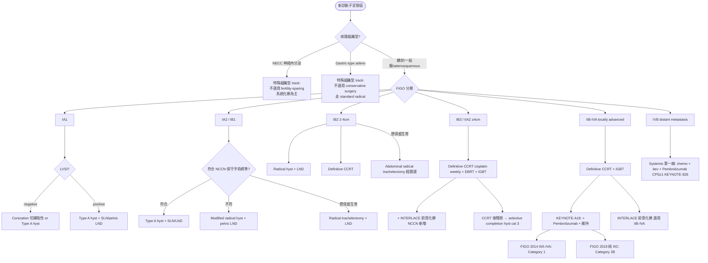
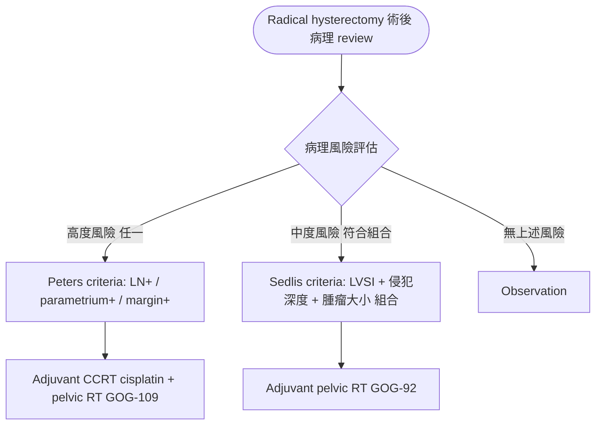
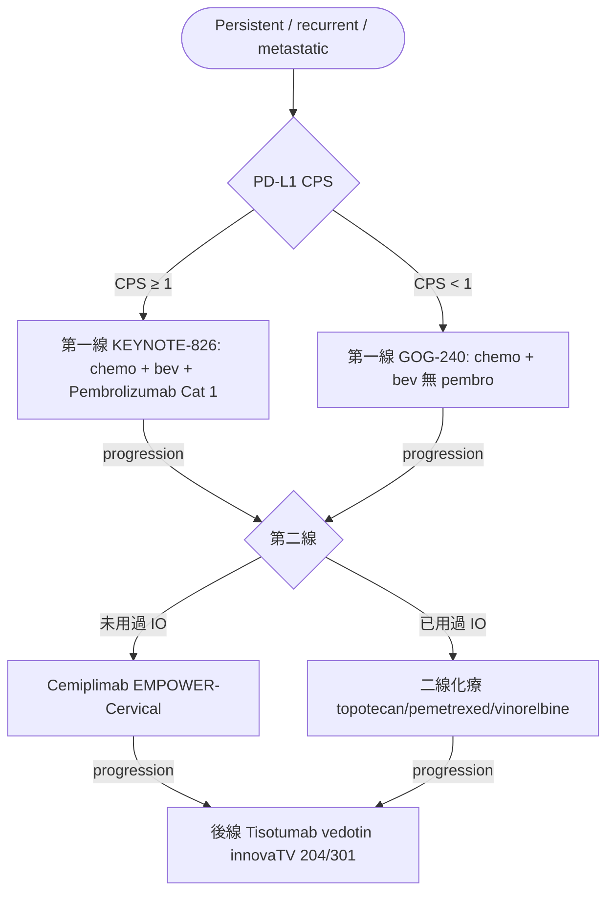

# 子宮頸癌處置流程草稿（給 NotebookLM 驗證用）

> 本檔是 `treatment.json` 的 Markdown 版本，含 3 個決策樹 + Sedlis/Peters criteria + 治療要點。
> 上傳到 NotebookLM 與 NCCN Cervical Cancer v.2.2026 PDF 做交叉驗證。
>
> **生成日期**：2026-05-14 · **review 狀態**：pending
>
> **NotebookLM 建議提問範本**：
>
> ```
> 請對照 NCCN Cervical Cancer Guidelines v.2.2026，
> 檢視我這份「子宮頸癌處置流程草稿」並指出：
> 1. 三個決策樹是否準確反映 NCCN flow chart
> 2. Sedlis criteria 4 種組合與 Peters criteria 3 條件是否正確
> 3. INTERLACE 與 KEYNOTE-A18 適用範圍是否符合 NCCN 標註
> 4. 7 個 treatment pearls 內容是否最新（特別是劑量、HR、ORR 數字）
> 5. 缺漏的重要 treatment branch（fertility-sparing 細節、surgical approach 對照、特殊組織型）
> 請引用 NCCN 章節（如 CERV-4、CERV-5、PRIN）。
> ```

---

## 1. 三個 Mermaid 決策樹

### 1️⃣ 原發治療決策樹（依分期）



### 2️⃣ 術後輔助治療決策（Sedlis vs Peters）



### 3️⃣ 復發 / 轉移性系統治療線



---

## 2. Sedlis Criteria（GOG-92, 1999）— 中度風險 → Adjuvant RT

**用途**：IB 期 radical hysterectomy 術後是否加 adjuvant pelvic RT
**處置**：符合任一組合 → adjuvant pelvic RT（不一定 chemo）

| LVSI | 間質侵犯深度 | 腫瘤大小 |
|---|---|---|
| positive | Deep 1/3 | Any size |
| positive | Middle 1/3 | ≥ 2 cm |
| positive | Superficial 1/3 | ≥ 5 cm |
| negative | Deep or Middle 1/3 | ≥ 4 cm |

**結果**：Adjuvant RT 顯著降低復發率（HR 0.53），OS 差異不顯著（追蹤短）
**引註**：Sedlis A, et al. *Gynecol Oncol* 1999;73:177-183. PMID 10329031

**💡 考點**：
- Sedlis = Intermediate risk = RT alone
- Peters = High risk = CCRT
- 記憶法：Peter (彼得) → P → **P**arametrium / **P**ositive node / **P**ositive margin

---

## 3. Peters Criteria（GOG-109, 2000）— 高度風險 → Adjuvant CCRT

**用途**：判定術後是否加 adjuvant CCRT（chemo + RT，而非單純 RT）
**處置**：任一條件成立 → adjuvant CCRT

- Positive pelvic lymph node（淋巴結轉移）
- Parametrial invasion（旁徑組織侵犯）
- Positive surgical margins（切緣陽性）

**結果**：4-yr PFS 80% vs 63% (HR 0.54)；4-yr OS 81% vs 71% (HR 0.50)
**引註**：Peters WA III, et al. *J Clin Oncol* 2000;18:1606-1613. PMID 10764420

**💡 考點**：FIGO 2018 後因 LN+ 直接歸 IIIC（primary CCRT 路徑），Peters criteria 在 surgery-first 路徑上的應用情境減少。

---

## 4. 治療要點（Treatment Pearls）

| 主題 | 重點 |
|---|---|
| **Open vs MIS Radical Hyst** | LACC trial (NEJM 2018) 後 NCCN 預設 open；MIS 限選擇個案 + 充分知情同意（DFS HR 3.74 倍差） |
| **Trachelectomy 適應症** | IA2-IB1 + LN(-) + 腫瘤 ≤ 2 cm：standard radical trachelectomy。IB2 (2-4 cm) 經篩選可做 abdominal radical trachelectomy（NCCN v.2.2026 開放） |
| **INTERLACE Pattern** | Carboplatin AUC 2 + Paclitaxel 80 mg/m² weekly × 6 週前導化療 → 接標準 CCRT。適用 IB3, IIA2, IIB-IVA。5-yr OS 80% vs 72%（Lancet 2024） |
| **KEYNOTE-A18 Pembrolizumab** | Pembrolizumab 與 CCRT 同步 + 維持 12 cycles。FIGO 2014 IIIA-IVA = cat 1；FIGO 2018 純 IIIC LN-defined = cat 2B |
| **IGBT (Image-Guided Brachy)** | 現代 brachytherapy 標準：MRI 或 CT 引導 + EQD2 to HR-CTV ≥ 85 Gy。劑量不達標時考慮 selective completion hyst（cat 3） |
| **KEYNOTE-826 第一線** | Persistent/recurrent/metastatic + CPS ≥ 1：chemo + bev + Pembrolizumab。OS 24.4 vs 16.5 月（HR 0.64） |
| **後線 ADC: Tisotumab Vedotin** | Anti-Tissue Factor ADC。innovaTV 204 ORR 24%；後續 innovaTV 301 (2024) 證實 OS 益處 → FDA 完全批准 |

---

## 5. 待 NotebookLM 補強的 review checklist

- [ ] 決策樹是否漏了 fertility-sparing 細節分支（如 IA1 + LVSI 是否可保留生育）
- [ ] Surgical approach（Type A / B / C hysterectomy）的 Querleu-Morrow classification 是否需明列
- [ ] Sedlis criteria 4 組合的數字是否完整（教科書常用簡化版可能不完全）
- [ ] FIGO 2018 IB1 (< 2cm) 的 conservative criteria 是否新增變動
- [ ] KEYNOTE-A18 與 CALLA trial（durvalumab，negative）對比是否要加入
- [ ] 老年 / poor PS 病人的 modified CCRT（如 carboplatin 取代 cisplatin）是否值得加
- [ ] 子宮頸癌復發部位（central vs distant）對治療選擇的影響
