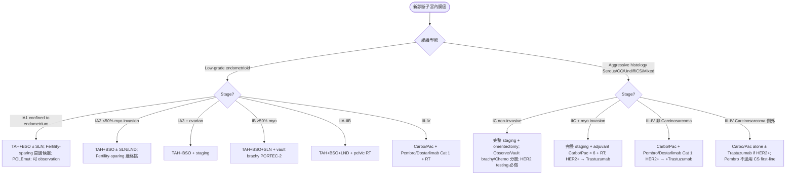
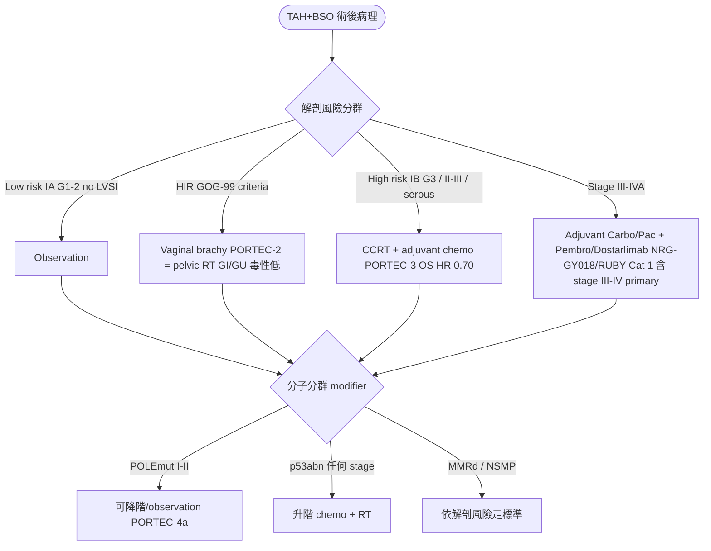
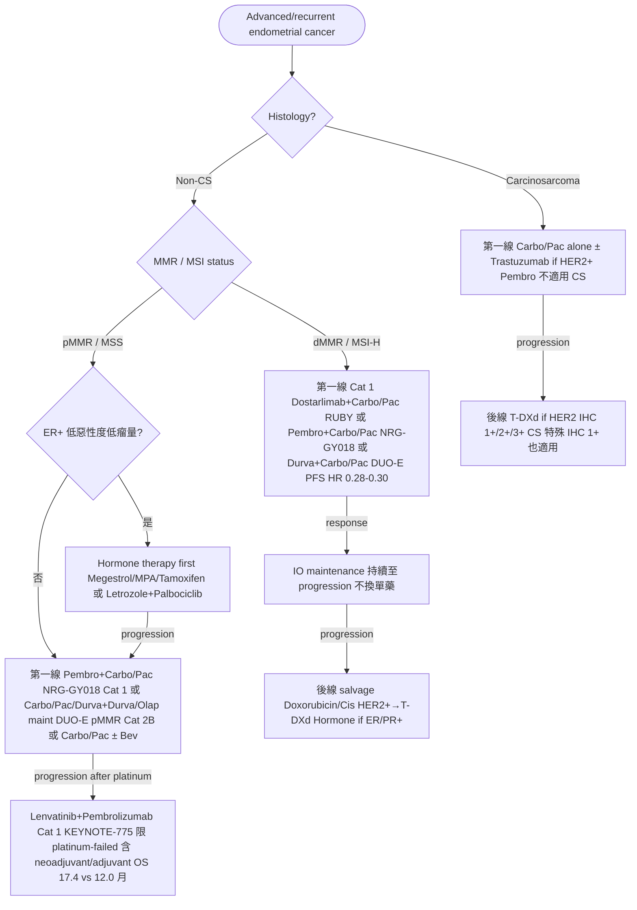

# 子宮內膜癌處置流程（v2 — 吃入 NotebookLM NCCN v.2.2026 review）

> 本檔是 `treatment.json` 的 Markdown 版本。
> **v2 update**（2026-05-16）：依 NotebookLM 對 NCCN Uterine Neoplasms v.2.2026 + ESGO/ESTRO/ESP + FIGO 2023 的交叉比對，套用 6 大修正。
>
> **修正概要**（v1 → v2）：
> 1. **第 1 樹改以 histology + stage 為主幹**，分子分群為分支（符合 NCCN ENDO-1/ENDO-11 邏輯，而非分子先於 stage）
> 2. **NRG-GY018 / RUBY 擴大適應症** 至 stage III-IV primary / adjuvant Cat 1（非只限 advanced/recurrent）；**DUO-E 分級**（dMMR Cat 1，pMMR maintenance Cat 2B）
> 3. **dMMR 後線 IO 順序釐清**：一線已用 IO+chemo → IO 作為 maintenance；單藥 IO 保留給前線未用 IO 病人
> 4. **Lenvatinib + Pembrolizumab** 加 **platinum-failed Cat 1** 條件（含 neoadjuvant + adjuvant）
> 5. **HER2 testing 擴大**：所有 p53abn（不論組織學）+ 所有轉移/復發；**T-DXd Carcinosarcoma 特殊**（IHC 1+/2+/3+ 都可，一般只 2+/3+）
> 6. **加 Carcinosarcoma 例外** 分支（CS first-line 用 Carbo/Pac alone，Pembro 不適用）+ **ER+ recurrent hormone therapy** 分支

---

## 1. 三個 Mermaid 決策樹（v2）

### 1️⃣ 原發治療決策樹（組織型態 + 分期為主幹）

### 2️⃣ 術後輔助治療決策（解剖風險 + 分子分群 modifier）

> ⚠️ **KEYNOTE-B21 negative**：Pembro 加 adjuvant 在 high-risk all-comer 未達 DFS（dMMR 有趨勢）→ NCCN 列為選項非首選。

### 3️⃣ Advanced / Recurrent 系統治療線（v2：含 ER+ hormone + CS 例外）

---

## 2. Treatment Pearls v2（13 個重點）

| 主題 | 重點 |
|---|---|
| **分子分群檢測時機** | 所有新診斷做 MMR IHC + p53 IHC（routine）+ POLE NGS（懷疑 POLEmut 或 stage I-II 想降階）。台灣健保已給付 MMR IHC。 |
| **SLN Mapping** | Apparently uterus-confined 首選 SLN。ICG cervical injection；mapping failure 那側 side-specific LND。Ultrastaging 偵測 micromet 計入 IIIC。 |
| **Fertility-sparing 嚴格條件** | Grade 1 + no invasion (MRI) + no LVSI。對應分期：**IA1**（confined to endometrium）為首選；**IA2**（<50% myo）需更嚴格挑。MPA 400-600 mg QD，6 月 D&C，CR ~70%、復發 ~30%。 |
| **PORTEC-2 改寫 HIR** | HIR vault brachy non-inferior to pelvic EBRT，GI/GU 毒性顯著低。NCCN 現以 vault brachy 為 HIR 首選。 |
| **PORTEC-3 High-risk CCRT+Chemo** | Serous / stage III / IB G3 / II-III 收益最大。OS HR 0.70（5-yr 81% vs 76%）。 |
| **NRG-GY018 vs RUBY — Cat 1 擴大** | 兩者皆 **Carbo/Pac + IO 第一線 Cat 1**，**適應症含 stage III-IV primary/adjuvant**（不只 advanced/recurrent）。NRG-GY018=Pembro；RUBY=Dostarlimab。dMMR 兩者 PFS HR ~0.30；pMMR Pembro 較強（HR 0.54）。 |
| **DUO-E Cat 分級** | **dMMR**：Carbo/Pac + Durva = **Cat 1**（與 Pembro/Dostarlimab 並列）。**pMMR**：Carbo/Pac + Durva 加 Durva/Olap maintenance = **Cat 2B**。 |
| **KEYNOTE-775 Lenva+Pembro — pMMR Cat 1 後線** | **Cat 1 適應症**：pMMR + 曾接受含鉑金化療之後（**含 neoadjuvant 與 adjuvant 都算**）。Lenva 20 mg QD + Pembro Q3W，OS 17.4 vs 12.0 月。注意 lenva 高血壓 + proteinuria 常需減量。 |
| **dMMR 後線 IO Maintenance vs 單藥** | 一線已用 IO+chemo → **IO 作為 maintenance 繼續**（不換單藥）。**Pembro/Dostarlimab 單藥**保留給「前線未曾用過 IO」的患者。 |
| **HER2 Testing — NCCN v.2.2026 擴大** | **新版適用**：(1) 所有 **p53abn**（不論組織學）、(2) 所有 **轉移/復發疾病**。舊版僅限 III-IV / recurrent serous / carcinosarcoma。IHC 3+ → HER2+；IHC 2+ → 加 ISH。 |
| **T-DXd — Carcinosarcoma 特殊** | **一般** endometrial：T-DXd 適用 IHC **2+/3+**。**Carcinosarcoma 例外**：IHC **1+/2+/3+ 皆可**（DESTINY-PanTumor02）。 |
| **Carcinosarcoma 例外（first-line 不加 Pembro）** | CS 病理歸 high-grade epithelial，但 NCCN 明確：**Stage III-IV first-line Carbo/Pac+Pembro 適用範圍除 Carcinosarcoma 外**。CS first-line 仍 **Carbo/Pac alone ± Trastuzumab（HER2+）**；後線 T-DXd IHC 1+ 起即可。 |
| **ER+ Advanced — Hormone 一線/後線** | ER+ recurrent/metastatic 特別**低惡性度、緩慢、低瘤量**患者，**Hormone 可作一線或後線選項**：Megestrol、MPA、Tamoxifen 交替、Letrozole+Palbociclib（CDK4/6i 組合）。NCCN 列「特定情況下有用」一線選項。 |

---

## 3. 範圍註

**不在本模組**：Endometrial stromal sarcoma 與其他 uterine sarcoma 歸 sarcoma 模組（治療以 BSO + 抗雌激素 AI 為首選，邏輯完全不同）。

---

*v2 修正基於 NCCN Uterine Neoplasms v.2.2026 + ESGO/ESTRO/ESP 2021 + FIGO 2023。*
