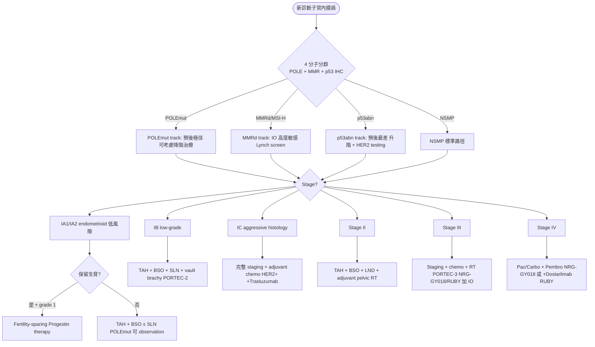
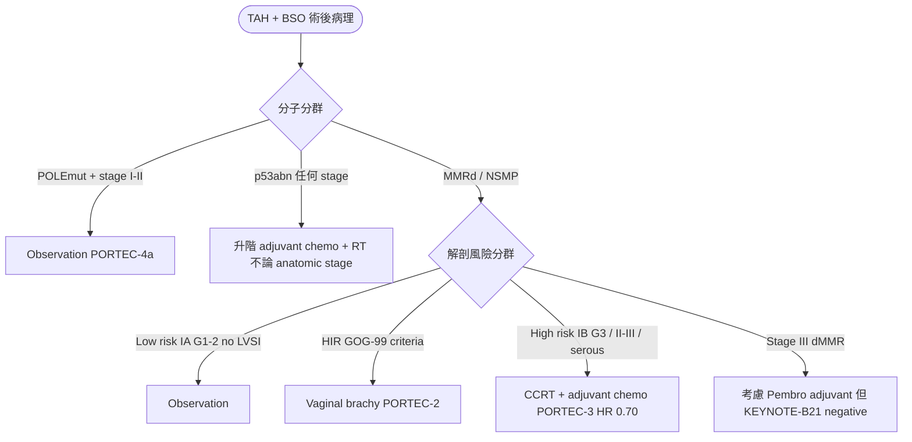
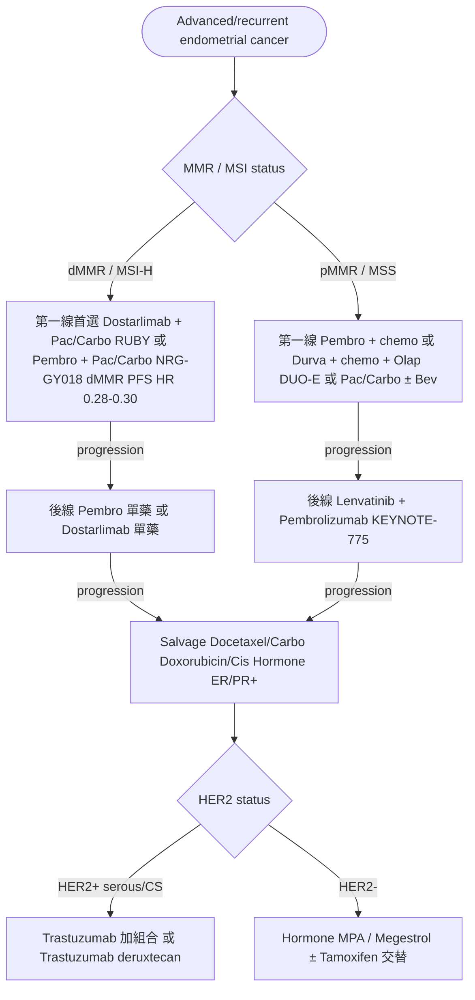

# 子宮內膜癌處置流程草稿（給 NotebookLM 驗證用）

> 本檔是 `treatment.json` 的 Markdown 版本，含 3 個 Mermaid 決策樹 + 8 個 treatment pearls。
> 上傳到 NotebookLM 與 NCCN v.1.2026 PDF 做交叉驗證。
>
> **生成日期**：2026-05-14 · **review 狀態**：draft-pending-NotebookLM-review
>
> **NotebookLM 建議提問範本**：
>
> ```
> 請對照 NCCN Uterine Neoplasms Guidelines v.1.2026 + ESGO/ESTRO/ESP 2021 + FIGO 2023，
> 檢視我這份「子宮內膜癌處置流程草稿」並指出：
> 1. 三個決策樹是否準確反映 NCCN flow chart（特別是分子分群整合路徑）
> 2. Adjuvant 決策中 PORTEC-2 vault brachy / PORTEC-3 CCRT+chemo 適應症是否準確
> 3. NRG-GY018 / RUBY / DUO-E / KEYNOTE-775 / KEYNOTE-B21 適應症與順序是否符合 NCCN
> 4. 8 個 treatment pearls 內容是否最新（特別是 HER2 cutoff、SLN 規則、分子檢測時機）
> 5. 缺漏的重要 treatment branch（fertility-sparing 細節、carcinosarcoma、ESS）
> 請引用 NCCN 章節（UTERINE-1, UTERINE-A 等）。
> ```

---

## 1. 三個 Mermaid 決策樹

### 1️⃣ 原發治療決策樹（依分子分群 + 分期）



### 2️⃣ 術後輔助治療決策（依風險群）



### 3️⃣ Advanced / Recurrent 系統治療線



---

## 2. Treatment Pearls（8 個重點）

| 主題 | 重點 |
|---|---|
| **分子分群檢測時機** | 所有新診斷 endometrial cancer 應做 MMR IHC + p53 IHC（routine），加 POLE NGS（懷疑 POLEmut 或 stage I-II 想降階）。台灣健保已給付 MMR IHC。 |
| **Sentinel Lymph Node Mapping** | Apparently uterus-confined 首選 SLN（取代 routine LND）。ICG cervical injection；mapping failure 那側做 side-specific LND。Ultrastaging 發現 micromet 計入 IIIC。 |
| **Fertility-sparing 嚴格條件** | Grade 1 endometrioid + no myometrial invasion (MRI) + no LVSI + 強烈希望 + 完成生育後 definitive hyst。MPA 400-600 mg QD，6 月 D&C，CR 率 ~70%、復發 ~30%。 |
| **PORTEC-2 改寫 HIR 標準** | HIR vault brachy non-inferior to pelvic EBRT，GI/GU 毒性低。NCCN 現以 vault brachy 為 HIR 首選。 |
| **PORTEC-3 High-risk CCRT + Chemo** | Serous / stage III / IB G3 / II-III 收益最大。OS HR 0.70（5-yr 81% vs 76%）。NCCN 列為 high-risk 標準。 |
| **NRG-GY018 vs RUBY 對比** | 都是 IO + chemo first-line。NRG-GY018 = Pembro。RUBY = Dostarlimab。dMMR 都 PFS HR ~0.30，pMMR Pembro 較強（HR 0.54）。 |
| **KEYNOTE-775 Lenva+Pembro 後線** | Lenva 20 mg QD + Pembro Q3W。pMMR endometrial cancer 後線標準。注意 lenva 高血壓 + proteinuria，常需減量。 |
| **HER2(+) Serous Trastuzumab** | Fader 2018：Pac/Carbo + Trastuzumab vs Pac/Carbo alone，OS 顯著提升。HER2 IHC cutoff 比 breast cancer 寬鬆。Stage III-IV serous 必做 HER2 testing。 |

---

## 3. 給 NotebookLM 的 review checklist

### A. 決策樹結構
- [ ] 第 1 樹「分子分群在 stage 之前」是否符合 NCCN 思維（NCCN 是否仍以 stage 為先？）
- [ ] 第 1 樹中 Stage III 加 NRG-GY018/RUBY 是否準確（這兩 trial 主要是 first-line for advanced/recurrent）
- [ ] 第 2 樹 KEYNOTE-B21 標記為 negative 是否符合最新解讀
- [ ] 第 3 樹 dMMR 後線「Pembro 單藥」順序是否合理（一線已用 IO，後線再 IO 效用?）

### B. PORTEC 系列適應症
- [ ] PORTEC-2 vault brachy 取代 pelvic EBRT 的 HIR 條件清單（GOG-99 criteria）
- [ ] PORTEC-3 high-risk 定義範圍（IB G3 / II / III / serous）
- [ ] GOG-249 negative 結果是否該明確 flag 給 reader

### C. IO + chemo 適應症細節
- [ ] NRG-GY018 適應症：advanced (III-IVA measurable) or recurrent，是否準確
- [ ] RUBY 適應症：primary stage III-IV or first recurrent，是否準確
- [ ] DUO-E maintenance Olaparib 對 pMMR 必加 vs dMMR 可選的 NCCN wording

### D. Lenvatinib + Pembrolizumab 線數
- [ ] KEYNOTE-775 適應症：platinum-failed advanced（不是一線）
- [ ] 是否可在第一線使用（LEAP-001 結果）

### E. HER2 testing 細節
- [ ] Endometrial serous HER2 cutoff 與 breast cancer 差異說明是否準確
- [ ] Carcinosarcoma 是否該與 serous 並列（DESTINY-PanTumor02 涵蓋哪些）
- [ ] Trastuzumab deruxtecan 是否真為 tumor-agnostic HER2 indication

### F. 缺漏
- [ ] Carcinosarcoma 治療是否該獨立 branch（過去視 sarcoma 但 NCCN 2018+ 視 high-grade epithelial）
- [ ] Clear cell endometrial cancer 治療差異
- [ ] Endometrial stromal sarcoma（low-grade ESS）是否該放這裡或 uterine sarcoma 模組
- [ ] Hormone therapy 適應症（不只 fertility-sparing，advanced ER/PR+ 也用）的決策位置

---

驗證完請把要修改的點告訴我（或直接編輯 `treatment.json` + commit）。
