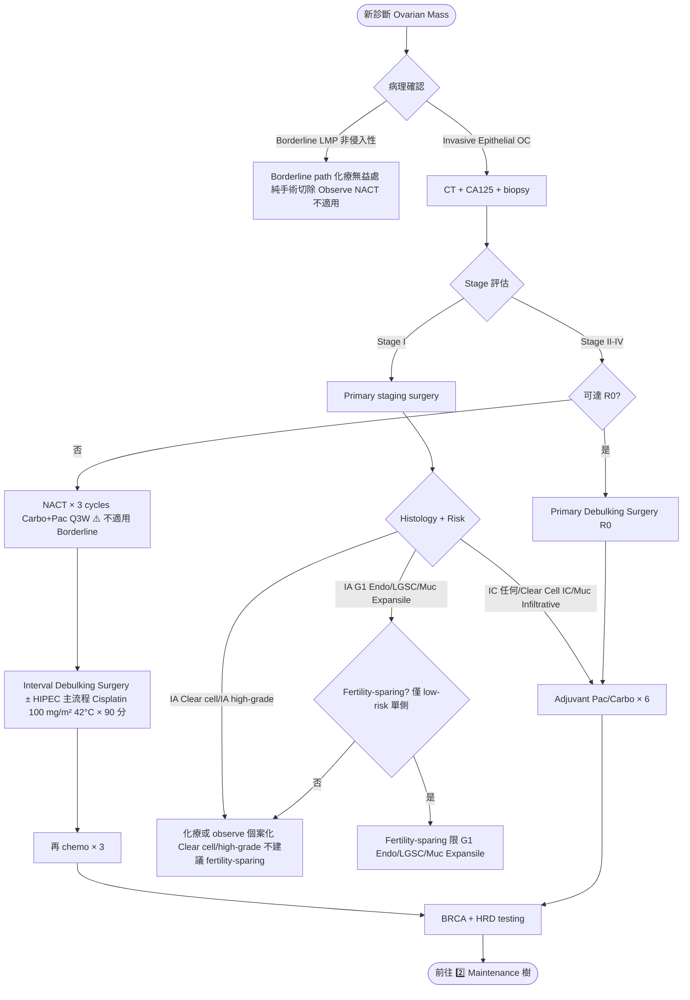
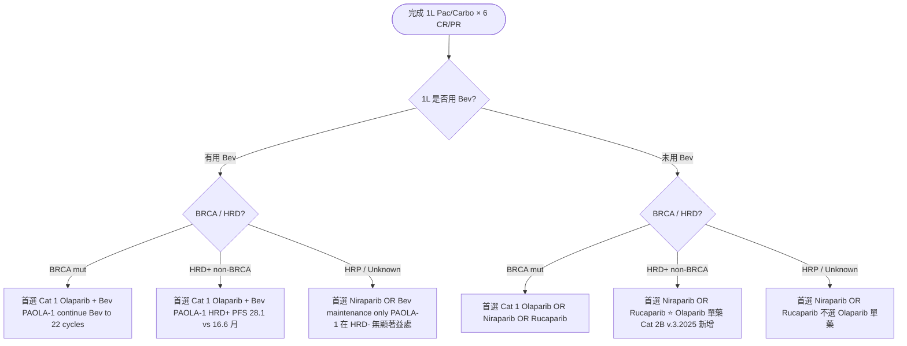
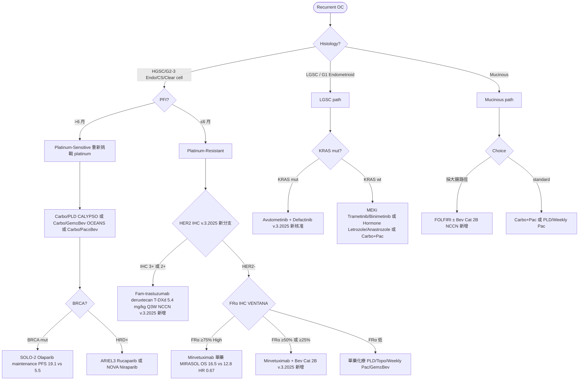

# 卵巢癌處置流程（v2 — 吃入 NotebookLM NCCN v.3.2025 review）

> 本檔是 `treatment.json` 的 Markdown 版本。
> **v2 update**（2026-05-17）：依 NotebookLM 對 NCCN Ovarian Cancer v.3.2025 + 台灣婦癌處方修訂 (20260112) 的交叉比對，套用 9 大 treatment 修正。
>
> **修正概要**（v1 → v2）：
> 1. **NACT 排除 Borderline / 非侵入性**（第 1 樹加分流）
> 2. **Fertility-sparing 嚴格化**：限單側 + low-risk histology（G1 Endo / LGSC / Mucinous expansile）；Clear cell / high-grade 不建議
> 3. 🚨 **PARPi v.3.2025 邏輯更新**（第 2 樹重寫）：以 **Bev 使用狀態 × BRCA/HRD/HRP** 雙軸決定 PARPi
>    - BRCA mut 未用 Bev：Olap/Niraparib/Rucaparib **Cat 1**；已用 Bev：Olap+Bev Cat 1
>    - HRD+ non-BRCA 未用 Bev：Niraparib/Rucaparib，**Olap 單藥 Cat 2B（新）**；已用 Bev：Olap+Bev Cat 1
>    - HRP/Unknown：Niraparib 或 Rucaparib，不論 Bev
> 4. **Bevacizumab 細節**：ICON-7 7.5 mg/kg vs GOG-218 15 mg/kg；up to 22 cycles；**Biosimilar 可替代**
> 5. **MIRASOL FRα 三段切點**：FRα ≥75% 單藥；**FRα ≥50% 或 ≥25% 可 +Bev Cat 2B（新）**
> 6. 🚨 **HER2+ T-DXd 新分支**：IHC 3+ 或 2+ platinum-resistant → Fam-trastuzumab deruxtecan
> 7. **Mucinous 後線 FOLFIRI ± Bev Cat 2B**（採大腸直腸路徑）
> 8. **LGSC 標靶新核准**：MEKi（Trametinib/Binimetinib）+ **Avutometinib/Defactinib for KRAS-mut LGSC（v.3.2025 新）**
> 9. **HIPEC 升主流程**：NACT 後 IDS 可加（Cisplatin 100 mg/m² 42°C × 90 分鐘）

---

## 1. 三個 Mermaid 決策樹（v2）

### 1️⃣ 原發治療決策樹（Primary Cytoreduction vs NACT-IDS + Borderline 分流）

### 2️⃣ Front-line PARPi — NCCN v.3.2025 更新邏輯

### 3️⃣ Recurrent Disease — Histology × PFI × Biomarker 三軸（含 HER2 + LGSC + Mucinous 分支）

---

## 2. Treatment Pearls v2（16 個重點）

| 主題 | 重點 |
|---|---|
| **Primary Surgery 達 R0 最強預後因子** | Bristow meta：每 10% optimal +5.5% OS。R0 > R1 (≤1cm) >> R2 (>1cm)。Center expertise 顯著影響 R0。 |
| **NACT-IDS — 排除 Borderline / 非侵入性** | EORTC 55971 / CHORUS NACT 與 PDS OS 相當。⚠️ **Borderline / 非侵入性不適用 NACT** — 純手術 + observe。 |
| **Fertility-Sparing 嚴格 histology + 單側** | 僅 Grade 1 Endometrioid / LGSC / Mucinous expansile / IA epithelial low-grade。**Clear cell + high-grade 不建議**（除 IA + 充分告知）。 |
| **HIPEC at IDS — v.3.2025 升主流程** | OVHIPEC-1 NACT-IDS 加 HIPEC cisplatin 100 mg/m² 42°C × 90 分，OS 45.7 vs 33.9（HR 0.67）。NCCN v.3.2025 從腳註移至主流程。 |
| **BRCA / HRD Testing 必做** | All epithelial OC germline + somatic BRCA1/2；stage II-IV 加 HRD score。BRCA ~15-20%；HRD+ ~50%；HRP ~50%。 |
| **Front-line PARPi v.3.2025 邏輯（Bev × biomarker）** | **未用 Bev**：BRCA mut → Olap/Niraparib/Rucaparib Cat 1；HRD+ non-BRCA → Niraparib/Rucaparib，**Olap 單藥 Cat 2B（新）**；HRP/Unknown → Niraparib/Rucaparib。**已用 Bev**：BRCA/HRD+ → Olap+Bev Cat 1；HRP/Unknown → Niraparib 或 Bev only。 |
| **Bevacizumab — 劑量 / 療程 / Biosimilar** | **ICON-7 7.5 mg/kg vs GOG-218 15 mg/kg**；up to 22 cycles 含 chemo+maint；**NCCN v.3.2025 新增 Biosimilar 為合理替代品**。禁忌：穿孔史、近 4-6 週手術、proteinuria UPC>2.0。 |
| **Dose-Dense Weekly Pac（JGOG-3016）** | 亞洲族群 PFS 28 vs 17 月、OS 100.5 vs 62.2 月；西方 GOG-262/ICON8 未複製。 |
| **IP Chemo — Stage II-IV optimally debulked 仍選項** | GOG-172 IP cisplatin/Pac vs IV，OS 65.6 vs 49.7（HR 0.75）。NCCN v.3.2025 仍列選項，多被 HIPEC at IDS 取代。 |
| **MIRASOL — FRα 三段切點** | **MIRASOL OS 16.5 vs 12.8（HR 0.67）**。**v.3.2025**：FRα ≥75% 單藥；**FRα ≥50% 或 ≥25% +Bev Cat 2B（新，中度表現擴大）**。眼毒性 keratopathy ~40% 必監測。 |
| **🆕 HER2+ T-DXd（v.3.2025 重大新增）** | **HER2 IHC 3+ 或 2+** platinum-resistant OC：**T-DXd 5.4 mg/kg IV Q3W**（NCCN v.3.2025 / 台灣處方）。⚠️ **ILD/pneumonitis** 嚴重 AE 需 baseline + 監測 CT；心毒性 baseline LVEF。 |
| **🆕 Mucinous — FOLFIRI ± Bev Cat 2B** | NCCN v.3.2025 新增 FOLFIRI ± Bev 為 Cat 2B（採大腸直腸路徑，KRAS-driven 共享）。診斷時排除 GI primary（CK7/CK20/CDX2/SATB2）。 |
| **🆕 LGSC 標靶 — MEKi + Avutometinib** | (1) Hormone Letrozole/Anastrozole；(2) MEKi Trametinib（GOG-281 PFS 13 vs 7.2 月，HR 0.48）/ Binimetinib；(3) **v.3.2025 Avutometinib + Defactinib** 專用 KRAS-mut recurrent LGSC（RAMP 201 / FAKtor-FRAME-1）。建議 recurrent LGSC routine 做 KRAS testing。 |
| **Granulosa Cell Special** | Adult granulosa cell **FOXL2 c.402C>G mut >97% 特異**。Surgery + observation；recurrent BEP / Letrozole。Endocrine active → 必做 endometrial sampling。 |
| **Germ Cell Tumor — Fertility-sparing 首選** | <30 歲多見；單側 USO + staging；BEP × 3-4 cycles；Dysgerminoma IA 可 observe；治癒率 >85%。 |
| **Carcinosarcoma of Ovary (MMMT)** | **視同 high-grade epithelial**，輔助 IV Pac/Carbo；**不沿用 uterine CS 的 ifosfamide sarcoma 路徑**。Maintenance 依 BRCA/HRD 評估。 |

---

*v2 修正基於 NCCN Ovarian Cancer v.3.2025 + ESMO-ESGO 2019 + 台灣婦癌處方修訂 (20260112)。*
