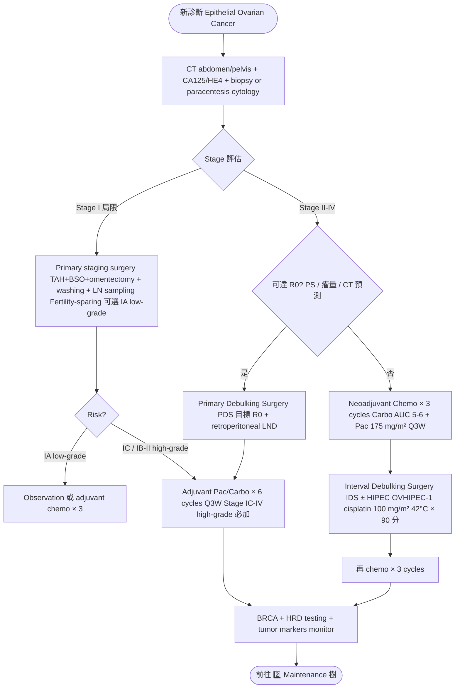
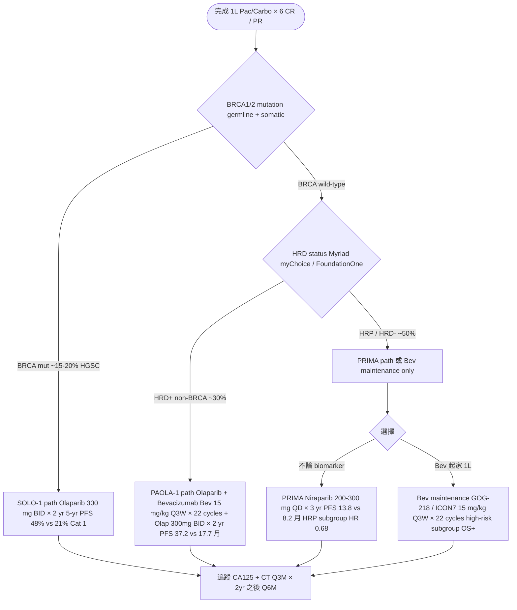
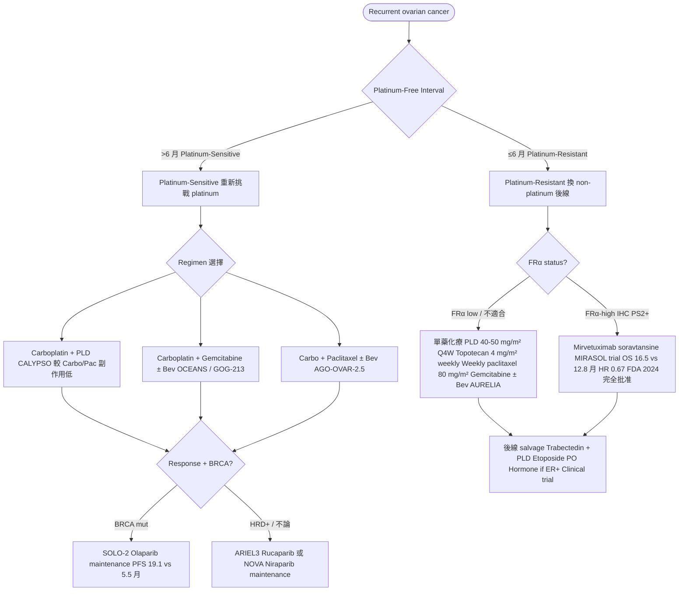

# 卵巢癌處置流程草稿（給 NotebookLM 驗證用）

> 本檔是 `treatment.json` 的 Markdown 版本，含 3 個 Mermaid 決策樹 + 10 個 treatment pearls。
> 上傳到 NotebookLM 與 NCCN v.2.2026 PDF 做交叉驗證。
>
> **生成日期**：2026-05-17 · **review 狀態**：v1 draft - pending NotebookLM review
>
> **建議的 NotebookLM source**：
> - NCCN Ovarian Cancer Guidelines v.2.2026 PDF
> - ESMO-ESGO Consensus Conference Statements 2019
> - 各 landmark trial PDF（GOG-218 / SOLO-1 / PAOLA-1 / PRIMA / MIRASOL）
>
> **NotebookLM 建議提問範本**：
>
> ```
> 請對照 NCCN Ovarian Cancer Guidelines v.2.2026 + ESMO-ESGO consensus 2019，
> 檢視我這份「卵巢癌處置流程草稿」並指出：
> 1. 三個決策樹是否準確反映 NCCN flow chart（特別是 PDS vs NACT 決策、PARPi 三分支、MIRASOL 後線）
> 2. 1L PARPi maintenance 三選一邏輯（SOLO-1 / PAOLA-1 / PRIMA）是否符合 NCCN OV-D
> 3. Bevacizumab 適應症（GOG-218 / ICON7 high-risk subgroup）是否準確標示
> 4. Platinum-sensitive vs resistant 後線決策樹是否完整（含 MIRASOL FRα-high）
> 5. 10 個 treatment pearls 內容是否最新（特別是 IP/HIPEC 地位、FRα cutoff、sex cord/germ cell 特殊）
> 6. 缺漏的重要 treatment branch（low-grade serous MEK inhibitor、clear cell HER2、borderline tumor、carcinosarcoma）
> 請引用 NCCN 章節（OV-1, OV-A, OV-B, OV-C, OV-D 等）。
> ```

---

## 1. 三個 Mermaid 決策樹

### 1️⃣ 原發治療決策樹（Primary Cytoreduction vs NACT-IDS）



### 2️⃣ Front-line Maintenance — BRCA / HRD / HRP 三分支



### 3️⃣ Recurrent Disease — Platinum-Sensitive vs Resistant



---

## 2. Treatment Pearls（10 個重點）

| 主題 | 重點 |
|---|---|
| **Primary Surgery 達 R0 是最強預後因子** | Bristow 2002 meta-analysis：每 10% optimal cytoreduction 增加，median OS 提升 5.5%。**R0 > R1 (≤1 cm) >> R2 (>1 cm)**。Center expertise（high-volume GO）顯著影響 R0 達成率。 |
| **NACT-IDS 適應症（EORTC 55971 / CHORUS）** | NACT × 3 → IDS → chemo × 3 與 primary debulking **OS 相當**（non-inferiority）。NACT 適應症：PS 差 / 大瘤量、廣泛上腹 / 預測無法 R0。NACT 圍術期併發症少。 |
| **BRCA / HRD Testing — 必做** | 所有 epithelial ovarian cancer（特別 HGSC）做 **germline + somatic BRCA1/2**；stage II-IV 加 HRD score。BRCA mut ~15-20% HGSC；HRD+ ~50%；HRP/HRD- ~50%。決定 PARPi 選擇與家族遺傳評估。 |
| **Front-line PARPi 選擇邏輯（記三句話）** | **BRCA mut → SOLO-1 Olaparib 單藥**（5-yr PFS 48% vs 21%）。**HRD+ non-BRCA → PAOLA-1 Olap + Bev**（PFS 37.2 vs 17.7 月）。**HRP / 不論 biomarker → PRIMA Niraparib**（PFS 13.8 vs 8.2 月；HRP subgroup HR 0.68）。 |
| **Bevacizumab 適應症（GOG-218 / ICON7）** | **GOG-218**：Bev + chemo + Bev maint vs chemo，PFS 14.1 vs 10.3 月（HR 0.72），OS 無差異。**ICON7**：high-risk subgroup（stage IV、suboptimal）OS +9 月。Bev 15 mg/kg Q3W × 22 cycles。適應症：stage III suboptimal / IV high-risk，或 PAOLA-1。 |
| **Dose-Dense Weekly Paclitaxel（JGOG-3016）** | **JGOG-3016**（亞洲）：Weekly Pac 80 mg/m² + Q3W carbo vs Q3W Pac/Carbo，PFS 28 vs 17 月（HR 0.71），OS 100.5 vs 62.2 月。但 **GOG-262 / ICON8**（西方）未複製。亞洲 patient 可考慮。 |
| **IP Chemotherapy — 歷史與現況** | **GOG-172** optimally debulked III：IP cisplatin + IP/IV pac vs IV，OS 65.6 vs 49.7 月（HR 0.75）。毒性高 + GOG-252（後續含 Bev）未複製。NCCN 列選項。**HIPEC at IDS**（OVHIPEC-1 OS 45.7 vs 33.9 月，HR 0.67）為新興替代。 |
| **Platinum-Resistant 後線新標準 — MIRASOL** | **MIRASOL 2024**：Mirvetuximab soravtansine（FRα-targeted ADC，DM4 payload）vs investigator's choice，**OS 16.5 vs 12.8 月（HR 0.67）**。適應症：FRα-high（IHC PS2+，VENTANA assay）platinum-resistant。FDA 2024 完全批准。**眼毒性（keratopathy）需密切監測**。 |
| **Sex Cord-Stromal — Granulosa Cell Special** | Adult granulosa cell（95%）— **FOXL2 c.402C>G mut（>97% 特異性）**。Surgery + observation 為主；recurrent 可 BEP / hormone（**Aromatase Inhibitor letrozole** 新興 hormone option）。Endocrine active → 子宮內膜增生風險，**必做 endometrial sampling**。 |
| **Germ Cell Tumor — Fertility-sparing 首選** | 年輕（<30 歲）女性多見；首選 **單側 USO + comprehensive staging**（保留對側卵巢與子宮）。化療 **BEP × 3-4 cycles** 對 yolk sac、immature teratoma、mixed 必加；**Dysgerminoma** stage IA 可 observe（高度 chemo/RT 敏感）。治癒率 >85%。 |

---

## 3. 給 NotebookLM 的 review checklist

### A. 決策樹結構
- [ ] 第 1 樹「PDS vs NACT 決策標準」是否準確（PS / 瘤量 / 預測 R0）
- [ ] 第 1 樹「Stage I fertility-sparing 條件」是否限制夠嚴格
- [ ] 第 2 樹「PARPi 三選一邏輯」（SOLO-1 / PAOLA-1 / PRIMA）是否符合 NCCN OV-D 流程
- [ ] 第 2 樹「Bev maintenance vs PARPi」併行或選一的描述是否準確
- [ ] 第 3 樹「Platinum-resistant FRα testing 時機」是否準確

### B. PARPi 適應症細節
- [ ] SOLO-1 是否限 BRCA mut + 1L platinum response（CR/PR）+ stage III-IV
- [ ] PAOLA-1 適應症是否限 1L Carbo/Pac/Bev response + HRD+（含 BRCA）
- [ ] PRIMA 是否真的「不論 biomarker」（含 HRP 子群顯著但較弱）
- [ ] SOLO-2 / ARIEL3 / NOVA 在 recurrent setting 的順序與選擇
- [ ] PARPi resistance 後是否仍可用其他 PARPi（NCCN wording）

### C. Bevacizumab 適應症細節
- [ ] GOG-218 vs ICON7 dose 差異（15 vs 7.5 mg/kg）是否反映 NCCN 建議
- [ ] Bev 加 maintenance 的 22 cycles 總期是否正確
- [ ] Bev 禁忌（穿孔、手術近 4-6 週）是否該明列

### D. Platinum-Resistant 後線細節
- [ ] MIRASOL FRα-high IHC PS2+ 切點（VENTANA assay）
- [ ] AURELIA Bev + chemo 在 platinum-resistant 的角色
- [ ] Trabectedin + PLD 在 partially platinum-sensitive (6-12 月)
- [ ] Hormone therapy（ER+）在 recurrent 的位置

### E. IP / HIPEC 細節
- [ ] GOG-172 IP chemo NCCN 現況（仍 cat 2A or 已降級？）
- [ ] OVHIPEC-1 HIPEC at IDS 適應症（NACT response 好的 stage III？）
- [ ] HIPEC cisplatin 100 mg/m² 42°C × 90 分鐘是否標準
- [ ] OVHIPEC-2 結果是否該補

### F. 缺漏
- [ ] **Low-grade serous (LGSC)** 特殊處置（MEK inhibitor trametinib、hormone）
- [ ] **Clear cell carcinoma** 特殊（HER2 testing、ARID1A）
- [ ] **Mucinous ovarian cancer** 鑑別 GI primary 與處置差異
- [ ] **Borderline ovarian tumor (LMP)** 是否該獨立 branch
- [ ] **Carcinosarcoma of ovary (MMMT)** 處置（high-grade epithelial 路徑）
- [ ] **STIC**（serous tubal intraepithelial carcinoma）發現後處置
- [ ] **HER2-positive ovarian cancer** 後線 T-DXd 適應症
- [ ] **Hormone therapy** 在 LGSC / granulosa cell / 高齡 ER+ 的角色

---

驗證完請把要修改的點告訴我（或直接編輯 `treatment.json` + commit）。
