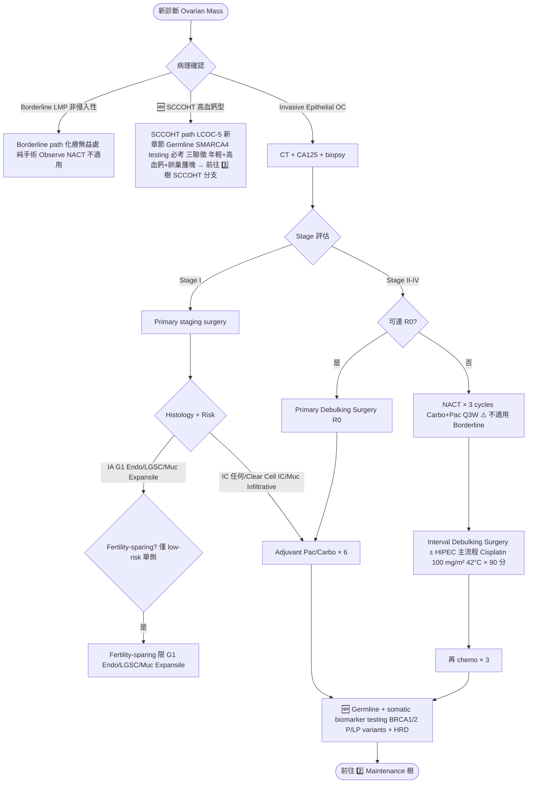
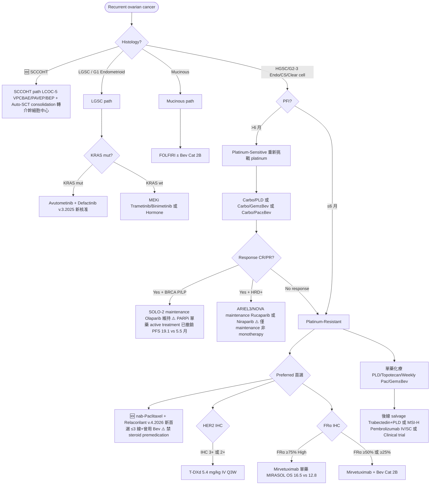

# 卵巢癌處置流程（v3 — 吃入 NotebookLM NCCN v.4.2026 重大更新）

> 本檔是 `treatment.json` 的 Markdown 版本。
> **v3 update**（2026-05-17）：依 NotebookLM 對 NCCN Ovarian Cancer **v.4.2026** 的最新比對，套用 6 大 treatment 修正。
>
> **v3 修正摘要**（v2 → v3）：
> 1. 🚨 **PARPi 單藥治療「復發 active treatment」全面移除**（OV-D 8/12 FDA 撤銷）：Niraparib/Olaparib/Rucaparib 不再作為 recurrent monotherapy；只剩 maintenance after recurrence therapy
> 2. 🚨 **Albumin-bound Paclitaxel + Relacorilant 為 platinum-resistant 新首選**（≤3 線、曾用 Bev；**禁 steroid premedication**）
> 3. 🆕 **SCCOHT 獨立路徑**（LCOC-5：SMARCA4 testing + VPCBAE/PAVEP/BEP + auto-SCT consolidation）
> 4. **Pembrolizumab SC 劑型新增**（+ berahyaluronidase alfa-pmph）替代 IV，for MSI-H/dMMR/TMB-H
> 5. **HGSC 患者評估個人風險後可考慮 HRT** 用於停經後症狀管理
> 6. **Biomarker 術語**：'germline and somatic biomarker testing'、'BRCA1/2 P/LP variants'

---

## 1. 三個 Mermaid 決策樹（v3）

### 1️⃣ 原發治療決策樹（加入 SCCOHT 分流 + biomarker 術語）

### 2️⃣ Front-line PARPi Maintenance（同 v2 邏輯 + biomarker 術語）

> 1L maintenance 邏輯不變：以 Bev 用否 × BRCA/HRD/HRP 雙軸決定 PARPi。完整 mermaid 詳見 `treatment.json`。

### 3️⃣ Recurrent Disease — v.4.2026 重大更新

---

## 2. Treatment Pearls v3（21 個重點，新增 5 個 🆕）

| 主題 | 重點 |
|---|---|
| Primary Surgery 達 R0 | R0 > R1 (≤1cm) >> R2 (>1cm)；center expertise 顯著影響 |
| NACT-IDS — 排除 Borderline / 非侵入性 | EORTC 55971 / CHORUS OS 相當；Borderline 純手術 + observe |
| Fertility-Sparing 嚴格條件 | 限 G1 Endo / LGSC / Muc expansile 單側；Clear cell + high-grade 不建議；SCCOHT germline SMARCA4 陰性可考慮 |
| HIPEC at IDS — v.3.2025 升主流程 | OVHIPEC-1 OS 45.7 vs 33.9 月 HR 0.67 |
| **🆕 Germline + Somatic Biomarker Testing** | v.4.2026 global change：'BRCA mutation' → 'BRCA1/2 P/LP variants'；HRD assay 多平台接受 |
| Front-line PARPi v.3.2025 邏輯 | 未用 Bev × BRCA/HRD/HRP 6 情境；HRD+ non-BRCA Olap 單藥 Cat 2B（新） |
| **🆕 🚨 PARPi 單藥治療「復發 active treatment」全面撤銷（v.4.2026 OV-D 8/12）** | FDA 撤銷公告：Niraparib/Olaparib/Rucaparib 不再作為 recurrent monotherapy；**只剩 maintenance after recurrence therapy 有反應後**。SOLO-2/ARIEL3 仍 OK 但需明標 maintenance only |
| **🆕 🚨 Albumin-bound Paclitaxel + Relacorilant — v.4.2026 PR 新首選** | 適用 ≤3 線 + 曾用 Bev；**⚠️ 絕對禁止 steroid premedication**（Relacorilant glucocorticoid receptor modulator 衝突）；antiemetic 改 5-HT3+NK1 antagonist |
| Bevacizumab — 劑量 / 療程 / Biosimilar | ICON-7 7.5 vs GOG-218 15 mg/kg；up to 22 cycles；Biosimilar 替代 |
| Dose-Dense Weekly Pac（JGOG-3016） | 亞洲 PFS 28 vs 17 月；西方未複製 |
| IP Chemo — Stage II-IV optimally debulked 仍選項 | GOG-172 OS 65.6 vs 49.7；多被 HIPEC at IDS 取代 |
| MIRASOL — FRα 三段切點 | ≥75% 單藥；≥50% 或 ≥25% +Bev Cat 2B；眼毒性 ~40% 必監測 |
| HER2+ T-DXd（v.3.2025） | IHC 3+ 或 2+ → T-DXd 5.4 mg/kg Q3W；⚠️ ILD/pneumonitis 監測 |
| **🆕 Pembrolizumab SC 劑型（v.4.2026）** | + berahyaluronidase alfa-pmph SC 替代 IV，for MSI-H/dMMR/TMB-H；給藥 ~2 分鐘 vs IV 30 分鐘；PK/療效等效 |
| Mucinous — FOLFIRI ± Bev Cat 2B | 採大腸直腸路徑；排除 GI primary |
| LGSC 標靶 — MEKi + Avutometinib | Trametinib/Binimetinib + **Avutometinib/Defactinib for KRAS-mut（v.3.2025 新）** |
| **🆕 SCCOHT — Small Cell Carcinoma of Ovary, Hypercalcemic Type（v.4.2026 LCOC-5）** | 三聯徵：年輕+高血鈣+卵巢腫塊；**germline SMARCA4 testing 必考**；一線 **VPCBAE/PAVEP/BEP**；**auto-SCT consolidation** 推薦；5-yr OS ~30%；SMARCA4 陰性可 fertility-sparing |
| Granulosa Cell Special | FOXL2 c.402C>G mut >97% 特異；必做 endometrial sampling |
| Germ Cell — Fertility-sparing 首選 | <30 歲多見；單側 USO+staging；BEP × 3-4；治癒率 >85% |
| Carcinosarcoma of Ovary (MMMT) | 視同 high-grade epithelial 用 Pac/Carbo |
| **🆕 HRT for HGSC 停經後（v.4.2026 新註）** | 經個人風險評估後，HGSC 可考慮 HRT 用於停經後症狀；打破過去保守刻板；ER/PR+ 或 LGSC/子宮內膜相關者較保留 |

---

*v3 修正基於 NCCN Ovarian Cancer **v.4.2026** + ESMO-ESGO 2019 + 台灣婦癌處方修訂 (20260112)。*
